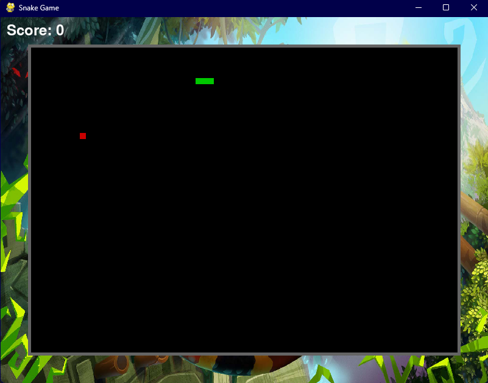
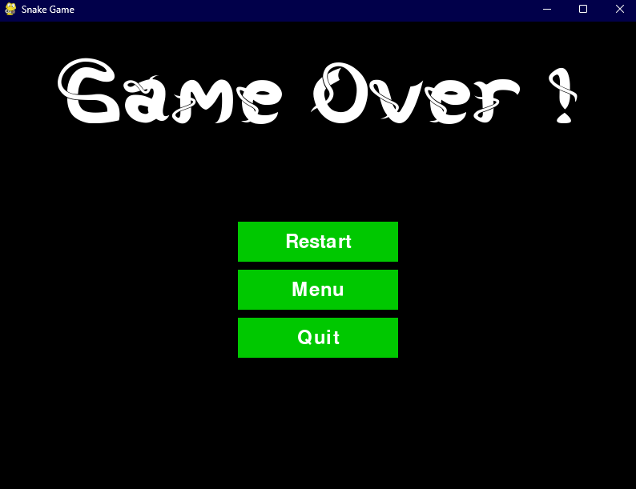

# 🐍 Snake Game - Python & Pygame 🕹️

Bienvenue sur le dépôt GitHub de **Snake Game** ! Ce projet est une version modernisée du classique jeu Snake, développé en utilisant Python et Pygame. L'objectif est simple : guider le serpent pour manger la nourriture, grandir et obtenir le meilleur score possible sans entrer en collision avec les murs ou le corps du serpent !

## 🎮 Fonctionnalités du Jeu

- **Choix du Mode** : Sélectionnez différents modes de jeu pour varier les défis.
- **Niveaux de Difficulté** : Choisissez entre **Easy**, **Medium**, et **Hard** pour ajuster la vitesse du serpent.
- **Surface de Jeu Adaptative** : La surface de jeu s'ajuste automatiquement lorsque la fenêtre est redimensionnée.
- **Graphismes Personnalisés** : Inclut des images de fond et des boutons personnalisés.
- **Score Dynamique** : Affichez votre score en temps réel et comparez vos meilleures performances.
- **Menus de Navigation** : Naviguez facilement à travers des menus stylisés pour démarrer ou quitter le jeu.

## 🖼️ Captures d'Écran

### Menu Principal

### En Jeu  

### Écran Game Over

## 📋 Installation

1. Clonez le dépôt sur votre machine locale.
2. Accédez au répertoire du projet.
3. Installez Pygame si ce n'est pas déjà fait.
4. Lancez le fichier principal pour démarrer le jeu.

## 📜 Règles du Jeu

- Dirigez le serpent pour manger la nourriture représentée par un carré rouge.
- À chaque morceau de nourriture mangé, le serpent grandit.
- Évitez de toucher les murs ou le corps du serpent, sinon c'est **Game Over** !

## 📝 TODO

- [ ] Ajouter de nouveaux modes de jeu.
- [ ] Intégrer des niveaux supplémentaires avec des obstacles.
- [ ] Améliorer les graphismes avec des sprites animés.
- [ ] Ajouter un système de sauvegarde des meilleurs scores.

## 🛠️ Technologies Utilisées

- **Python** - Langage de programmation principal.
- **Pygame** - Librairie pour la création de jeux en 2D.